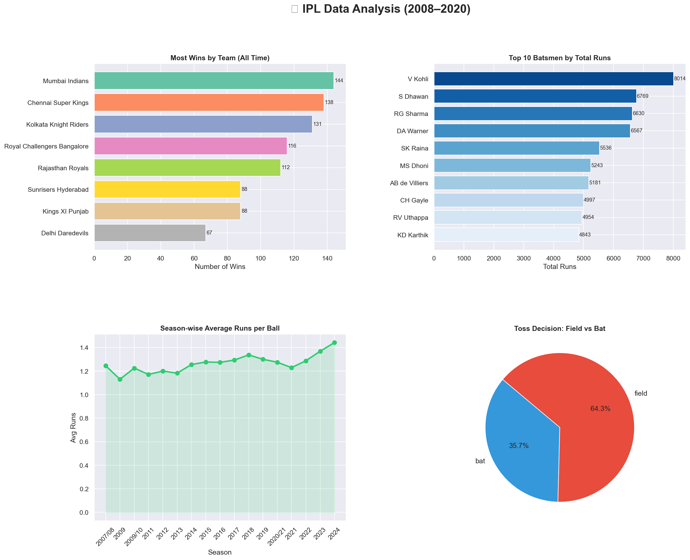

# 🏏 IPL Data Analysis (2008–2020)

## Overview
End-to-end data analysis project on 260,000+ ball-by-ball IPL records using Python and SQL.

## Tech Stack
- **Python** (Pandas, Matplotlib, Seaborn)
- **SQL** (SQLite — 6 analytical queries)
- **Dataset** — Kaggle IPL Complete Dataset (2008–2020)

## Key Insights
- Mumbai Indians have the most wins (144) across all IPL seasons
- V Kohli leads all-time runs with 8,014 runs
- 64% of teams choose to field first after winning the toss
- Average runs per ball has steadily increased since 2007

## Dashboard


## How to Run
```bash
pip install pandas matplotlib seaborn
python load_data.py
python visualise.py
```